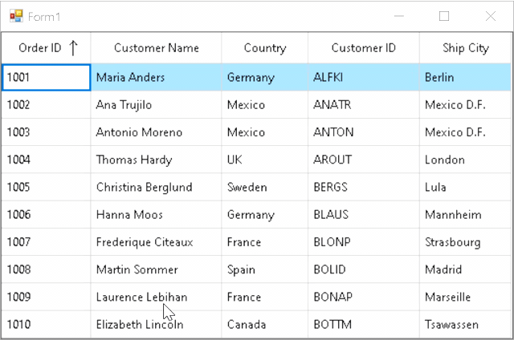

# How to Enter the Unique Value in WinForms DataGrid?

This sample illustrates how to enter the unique value in [WinForms DataGrid](https://www.syncfusion.com/winforms-ui-controls/datagrid) (SfDataGrid).

In `DataGrid` you can make a specific column accept unique value per row using [SfDataGrid.CurrentCellValidating](https://help.syncfusion.com/cr/windowsforms/Syncfusion.WinForms.DataGrid.SfDataGrid.html#Syncfusion_WinForms_DataGrid_SfDataGrid_CurrentCellValidating) event.


#### C#
```c#
sfDataGrid1.CurrentCellValidating += SfDataGrid1_CurrentCellValidating;

private void SfDataGrid1_CurrentCellValidating(object sender, Syncfusion.WinForms.DataGrid.Events.CurrentCellValidatingEventArgs e)
{
    if (e.Column.MappingName == "OrderID")
    {
        for (int i = 0; i < sfDataGrid1.View.Records.Count; i++)
        {
            if ((this.sfDataGrid1.View.Records[i].Data as OrderInfo).OrderID.ToString().Equals((e.NewValue.ToString()))&&(e.NewValue.ToString() != e.OldValue.ToString()))
            {
                e.IsValid = false;
                e.ErrorMessage = "Invalid Value";
                break;
            }
        }
    }
}
```



## Requirements to run the demo
 Visual Studio 2015 and above versions